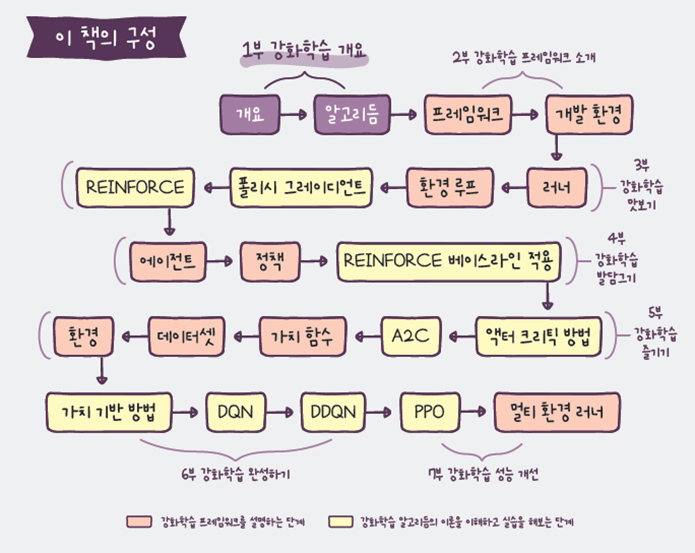

# 파이토치로 완성하는 실전 강화학습
**본 저장소는 [파이토치로 완성하는 실전 강화학습] 책에서 설명하는 강화학습 프레임워크와 강화학습 알고리즘의 소스 코드를 제공하고 있습니다.**



## 1. 디렉토리 구성
|디렉토리              |설명                        |
|:--        |:--                          |
| agents 	| REINFORCE, A2C, DQN, DDQN, PPO 에이전트 관련 클래스 정의 |
| config	| 에이전트 실행을 위한 설정 파일 |
| datasets	| 데이터셋 클래스 정의 |
| envs	    | 환경 클래스 정의 |
| models	| 정책과 가치 함수 모델 정의 |
| runner	| 에이전트 실행을 위한 러너와 환경 루프 클래스 정의 |
| utils	    | 다양한 유틸리티 함수 정의 |

##  2. 개발 환경 설치
#### 2-1. 가상 환경 구성
Python 3.9 버전의 가상 환경을 만든다. 
예를 들어, 다음과 같은 conda 명령어로 'RL_Book' 가상환경을 만들어 보자.
```bash
conda create -n RL_Book python=3.9
```

#### 2-2. PyTorch 설치
[PyTorch 홈페이지](https://pytorch.org/get-started/locally/)에 가면 
로컬 환경에 맞게 PyTorch 설치 명령어를 생성해 주는 기능이 제공되고 있으니 
이를 활용하여 PyTorch를 설치해보자.
##### CPU 버전
```bash
pip3 install torch torchvision torchaudio
```
##### GPU 버전
다음 명령어는 CUDA 11.8 버전 상에서 PyTorch GPU 버전을 설치하는 예시이다.
```bash
pip3 install torch torchvision torchaudio --index-url https://download.pytorch.org/whl/cu118
```
   * GPU 버전을 설치할 때는 CUDA 툴킷과 cuDNN이 설치되어 있어야 하므로 [CUDA](https://developer.nvidia.com/cuda-downloads)와 [cuDNN](https://developer.nvidia.com/rdp/cudnn-archive)에서 download 받아서 설치하라.

#### 2-3. 파이썬 패키지 설치
requirement.txt을 이용해서 파이썬 패키지를 일괄로 설치한다.

```bash
pip3 install -r requirements.txt
```
#### 2-4. 개발 환경 설치 점검
강화학습 프레임워크를 개발하기 위한 환경이 정상적으로 구성됐는지 확인해 보자! 

##### OpenGym 설치 확인
```bash
python run_gym.py --env LunarLanderContinuous-v2 --steps 1000
```
   * --env: OpenGym 환경 이름 
   * --steps: 환경과의 상호작용 횟수

##### 강화학습 프레임워크 실행 방법
 
```bash
python main.py --agent ppo --env CartPole-v1
```
  * --agent: 에이전트 이름 {reinforce, reinforce_b, a2c, dqn, ddqn, ppo}
  * --env: 환경 이름 {CartPole-v1, LunarLanderContinuous-v2}

세부적인 설정 항목은 [여기](config/agents/README.md)를 참고하세요.

## 3. 라이선스
이 저장소의 소스 코드는 [GPL 3.0 라이선스](LICENSE)를 따릅니다.</br>
GPL 3.0 라이선스는 상업용과 비상업용으로 자유롭게 이용하으며 사용 시 출처를 밝히고 소스를 공개해야 할 의무가 있습니다.

## 4. 자주 묻는 질문

**1) 파이썬은 어떤 버전을 사용해야 하나요?**

  * 최종 테스트 버전은 Python 3.9입니다.</br>
  * 단, Python 3.7이나 3.8에서도 실행은 될 수 있으나 테스트는 수행되지 않았습니다. 

**2) PyTorch는 어떤 버전을 사용해야 하나요?**

최종 테스트 버전은 아래와 같습니다. 최신 버전을 설치해서 이슈가 발생하지 않으면 그냥 사용하셔도 됩니다.
  * torch 2.7.1
  * torchvision 0.22.1
  * torchaudio 2.7.1
```bash
pip3 install torch==2.3.1 torchvision==0.18.1 torchaudio==2.3.1 --index-url https://download.pytorch.org/whl/cu118
```
**3) 실행을 헀는데 책에 있는 그래프와 같은 모양으로 성능이 나오지 않아요.**

main.py에서 패키지의 난수 발생기의 씨드를 랜덤하게 초기화하기 떄문에 실행할 때마다 결과가 달라질 수 있습니다.
* 여러 번 실행하다 보면 원하는 성능이 나오는 실행을 찾을 수 있습니다. 
* 성능을 높이고 싶다면 직접 하이퍼파라미터 튜닝을 하시면 됩니다. 

**4) 가장 잘 나오는 실행 결과를 재현하고 싶어요.**

다음과 같이 코드와 설정을 수정하면 재현할 수 있습니다.
* main.py에서 패키지의 난수 발생기의 씨드를 콘솔에 출력된 씨드값(random_seed)으로 초기화합니다.
* 설정 파일에 torch_deterministic를 True 지정합니다.

