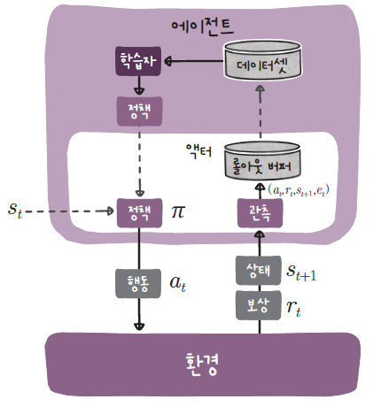

# 강화학습 프레임워크 파일 및 클래스 구성

## 디렉토리 구성
| 디렉토리                            |설명                        |
|:--------------------------------|:--                          |
| [agents](agents/README.md) 	    | REINFORCE, A2C, DQN, DDQN, PPO 에이전트 관련 클래스 정의 |
| [config](config/README.md)	     | 에이전트 실행을 위한 설정 파일 |
| [datasets](datasets/README.md)	 | 데이터셋 클래스 정의 |
| [envs](envs/README.md)	         | 환경 클래스 정의 |
| [models](models/README.md)	     | 정책과 가치 함수 모델 정의 |
| [runner](runner/README.md)	     | 에이전트 실행을 위한 러너와 환경 루프 클래스 정의 |
| [utils](utils/README.md)	       | 다양한 유틸리티 함수 정의 |
