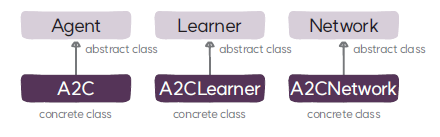

# A2CLearner 클래스
`A2CLearner`는 A2C 알고리즘의 학습자 클래스로 `Learner`를 상속한다.

## A2CLearner
### 속성
* **정책(`policy`)**: 네트워크에서 생성한 정책을 참조하는 변수로 편의를 위해 정의하고 있다.
* **가치 함수(`critic`)**: 네트워크에서 생성한 가치 함수를 참조하는 변수로 편의를 위해 정의하고 있다.
* **옵티마이저(`optimizer`)**: 딥러닝 모델의 학습을 위한 최적화 알고리즘으로 `Adam`을 사용한다.
* **정책 학습률 스케줄러(`policy_lr_scheduler`)**: 정책의 학습률을 스케줄링하는 코사인 스케줄러이다. 초기 학습률을 0도에서 90도 사이의 곡선을 따라 최대 환경 스텝까지 서서히 감소시키는 방식으로 구현돼 있다.
* **가치 함수 학습률 스케줄러(`critic_lr_scheduler`)**: 가치 함수의 학습률을 스케줄링하는 코사인 스케줄러이다.

### 메서드
* **`__init__`**: Learner 클래스의 초기화 메서드를 호출해 학습자를 초기화 하고, 정책과 가치 함수를 학습하기 위한 Adam 옵티마이저와 학습률 스케줄러를 생성한다.
* **`_loss`**: A2C 알고리즘의 목적 함수에 따라 정책의 손실을 계산하고, 가치 함수의 손실은 평균 제곱 오차로 계산한다.
* **`_calc_target_value`**: 가치 함수의 타깃과 이득을 ➊ 몬테카를로 리턴 ➋ n-스텝 리턴 ➌ GAE 방식 중 하나로 계산하고 버퍼에 추가 데이터 필드로 저장한다.
* **`update`**: A2C 알고리즘의 목적 함수에 따라 손실을 계산해서 정책과 가치 함수를 학습하고 성능 정보를 로깅한다.