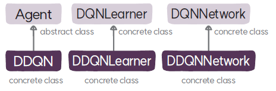

# DDQNLearner 클래스
`DDQNLearner`는 더블 DQN 알고리즘의 학습자 클래스로 `DQNLearner`를 상속한다.

## DDQNLearner

### 메서드
* **`__init__:`** `DQNLearner` 클래스의 초기화 메서드를 호출해 학습자를 초기화한다.
* **`update`**: 더블 Q-러닝 업데이트 식에 따라 타깃을 계산해서 휴버 손실로 가치 함수를 학습한다. 그리고 타깃 가치 함수 모델을 하드 및 소프트 업데이트하고 성능 정보를 로깅한다.