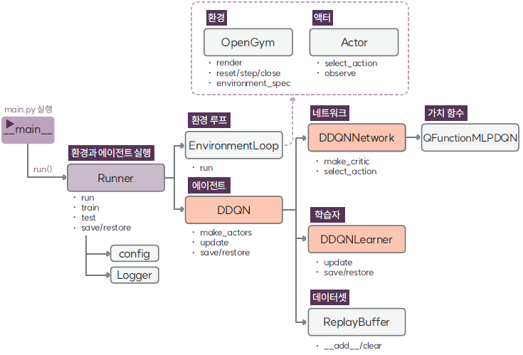

# 더블 DQN 알고리즘

## 1. 디렉토리 구성
| 파일 이름               |설명                        | 설명                                    |
|:--------------------|:--                          |:--------------------------------------|
| `ddqn.py`           | 에이전트 클래스 | 더블 DQN 알고리즘의 에이전트인 `DDQN`가 정의돼 있다        | 
| `ddqn_learner.py`    | 학습자 클래스 | 더블 DQN 알고리즘의 학습자인 `DDQNLearner`가 정의돼 있다.  | 
| `ddqn_network.py`    | 네크워크 클래스 | 더블 DQN 알고리즘의 네트워크인 `DDQNNetwork`가 정의돼 있다. | 

##  2. 클래스
더블 DQN 알고리즘은 에이전트, 네트워크, 학습자 클래스인 `DDQN`, `DDQNLearner`, `DDQNNetwork`로 구현돼 있으며 
이들은 `Agent`, `Learner`, `Network`를 상속하고 있다

* [`DDQN`](DDQN.md)는 더블 DQN 알고리즘의 에이전트 클래스로 `Agent`를 상속한다.
* [`DDQNNetwork`](DDQNNetwork.md)는 더블 DQN 알고리즘의 네크워크 클래스로 `DQNNetwork`를 상속한다.
* [`DDQNLearner`](DDQNLearner.md)는 더블 DQN 알고리즘의 학습자 클래스로 `DQNLearner`를 상속한다.
* 
##  3. 클래스 관계도
더블 DQN 알고리즘을 실행하면 다음과 같은 순서로 관련 객체가 생성된다.

객체의 생성 순서를 설명하면 다음과 같다.
* `main.py`는 `Runner`를 생성하고 `run()` 메서드를 호출한다.
* `Runner`의 `run()` 메서드에서는 강화학습의 핵심 구성 모듈인 에이전트 `DDQN`와 에이전트와 환경이 상호작용을 하도록 환경 루프 `EnvironmentLoop`를 생성한다.
* `DDQN`는 에이전트를 구성하는 네트워크, 학습자, 데이터셋인 `DDQNNetwork`, `DDQNLearner`, `ReplayBuffer`를 생성한다.
* `DDQNNetwork`는  가치 함수인 `QFunctionMLPDQN`과 생성한 후 이를 복사해 타깃 가치 함수를 생성한다.
* 환경 루프 `EnvironmentLoop`는 환경인 `OpenGym`과 액터 `Actor`를 생성한다.