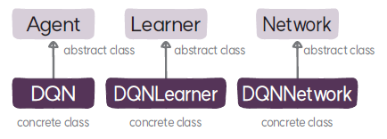

# DQNLearner 클래스
`DQNLearner`는 더블 DQN 알고리즘의 학습자 클래스로 `Learner`를 상속한다.

## DQNLearner
### 속성
* **가치 함수(`critic`)**: 네트워크에서 생성한 가치 함수를 참조하는 변수로 편의를 위해 정의하고 있다.
* **타깃 가치 함수(`target_critic`)**: 네트워크에서 생성한 타깃 가치 함수를 참조하는 변수로 편의를 위해 정의하고 있다.
* **옵티마이저(`optimizer`)**: 딥러닝 모델의 학습을 위한 최적화 알고리즘으로 `Adam`을 사용한다.
* **학습률 스케줄러(`critic_lr_scheduler`)**: 가치 함수의 학습률을 스케줄링하는 코사인 스케줄러를 사용한다.
* **손실 함수(`loss`)**: 가치 함수를 학습하기 위한 손실 함수로 휴버 손실(`nn.HuberLoss`) 함수로 정의된다.
* **최종 타깃 업데이트 스텝(`last_target_update_step`)**: 마지막으로 타깃 가치 함수를 업데이트한 타입 스텝이다.

### 메서드
* **`__init__:`**: `Learner` 클래스의 초기화 메서드를 호출해 학습자를 초기화하고, 가치 함수를 학습하기 위해 `Adam` 옵티마이저와 학습률 스케줄러, 휴버 손실 함수를 생성한다.
* **`update`**: Q-러닝 업데이트 식에 따라 타깃을 계산해서 휴버 손실로 가치 함수를 학습한다. 그리고 타깃 가치 함수 모델을 하드 업데이트 또는 소프트 업데이트하고 성능 정보를 로깅한다.