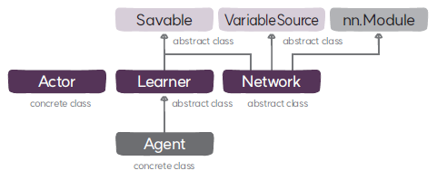

# Network 클래스
`Network`는정책과 가치함수 모델을 통합적으로 관리하는 네트워크의 베이스 클래스로
`nn.Module`, `VariableSource`, `Savable`을 상속한다.

## Network
### 속성
* **설정(`config`)**: 설정 항목을 저장하고 있는 SimpleNamespace 타입의 객체이다.
* **환경 정보(`environment_spec`)**: 환경 정보를 제공하는 객체로 행동 공간과 상태 공간을 확인할 때 사용한다.
* **연속 행동 여부(`b_continuous_action`)**: 행동이 연속 행동인지 여부를 나타낸다.
* **행동 벡터의 크기(`action_dim`)**: 연속 행동인 경우 정책이 출력해야 할 행동의 개수가 되고 이산 행동의 경우 행동의 종류가 된다.10
* **상태 벡터의 크기(`state_dim`)**: 정책과 가치 함수의 입력으로 사용될 상태 벡터의 크기이다.

### 메서드
* **`__init__`**: ➊ 정책과 가치 함수의 입력과 출력 데이터인 상태와 행동의 크기를 계산하고 ➋ 행동이 연속 행동인지 이산 행동인지 구분한다.
* **`select_action`**: 정책 또는 가치 함수를 통해 행동을 선택하는 추상 메서드이다.
* **`_log_prob`**: 정책의 손실을 계산할 때 필요한 행동의 로그 가능도를 계산한다.
* **`forward`**: 정책과 가치 함수를 실행해서 정책과 가치 함수의 손실을 계산할 때 필요한 정보를 반환한다.
* **`cuda`**: 네트워크의 상태(파라미터와 버퍼)를 GPU로 이동하는 추상 메서드이다.
* **`save`**: 네트워크의 상태(파라미터와 버퍼)를 체크포인트로 저장한다.
* **`restore`**: 체크포인트에서 네트워크의 상태(파라미터와 버퍼)를 읽어서 로딩한다.
* **`get_variables`**: 네트워크의 상태(파라미터와 버퍼)를 반환한다.
