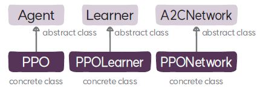

# PPO 알고리즘

## 1. 디렉토리 구성
| 파일 이름               |설명                        | 설명                                       |
|:--------------------|:--                          |:-----------------------------------------|
| `ppo.py`            | 에이전트 클래스 | PPO 알고리즘의 에이전트인 `PPO`가 정의돼 있다            | 
| `ppo_learner.py`   | 학습자 클래스 | PPO 알고리즘의 학습자인 `PPOLearner`가 정의돼 있다.  | 
| `ppo_network.py`   | 네크워크 클래스 | PPO 알고리즘의 네트워크인 `PPONetwork`가 정의돼 있다. | 

##  2. 클래스
PPO 알고리즘은 에이전트, 네트워크, 학습자 클래스인 `PPO`, `PPOLearner`, `PPONetwork`로 구현돼 있으며 
이들은 `Agent`, `Learner`, `A2CNetwork`를 상속하고 있다

* [`PPO`](PPO.md)는 PPO 알고리즘의 에이전트 클래스로 `Agent`를 상속한다.
* [`PPONetwork`](PPONetwork.md)는 PPO 알고리즘의 네크워크 클래스로 `Network`를 상속한다.
* [`PPOLearner`](PPOLearner.md)는 PPO 알고리즘의 학습자 클래스로 `Learner`를 상속한다.

##  3. 클래스 관계도
PPO 알고리즘을 실행하면 다음과 같은 순서로 관련 객체가 생성된다.

객체의 생성 순서를 설명하면 다음과 같다.
* `main.py`는 `Runner`를 생성하고 `run()` 메서드를 호출한다.
* `Runner`의 `run()` 메서드에서는 강화학습의 핵심 구성 모듈인 에이전트 `PPO`와 에이전트와 환경이 상호작용을 하도록 환경 루프 `EnvironmentLoop`를 생성한다.
* `PPO`는 에이전트를 구성하는 네트워크, 학습자, 데이터셋인 `PPONetwork`, `PPOLearner`, `RolloutBuffer`를 생성한다.
* `PPONetwork`는 정책과 가치 함수를 생성한다. 정책은 연속 행동인 경우에는 `GaussianPolicyMLP`를 생성하고 이산 행동인 경우에는 `CategoricalPolicyMLP`를 생성한다. 가치 함수는 `ValueFunctionMLP`를 생성한다.
* 환경 루프 `EnvironmentLoop`는 환경인 `OpenGym`과 액터 `Actor`를 생성한다.