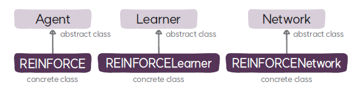

# REINFORCENetwork 클래스
`REINFORCENetwork`는 REINFORCE 알고리즘의 학습자 클래스로 `Network`를 상속한다.

## REINFORCENetwork
### 속성
* **정책 모델(`policy`)**: 정책의 딥러닝 모델로 에이전트의 행동이 이산 행동인 경우 `CategoricalPolicyMLP` 클래스로 정의하고 연속 행동인 경우 `GaussianPolicyMLP` 클래스로 정의한다.

### 메서드
* **`__init__`**: 부모 클래스인 `Network`의 초기화 함수를 호출해서 네트워크를 초기화하고 정책을 생성한다.
* **`make_policy`**: 연속 행동인 경우 가우시안 분포를 출력하는 MLP 정책인 `GaussianPolicyMLP`를 생성하고, 이산 행동인 경우 카테고리 분포를 출력하는 MLP 정책인 `CategoricalPolicyMLP`를 생성한다.
* **`select_action`**: 정책 모델을 실행해서 행동을 선택한다. 단, 학습 모드와 추론 모드에 따라 행동을 선택하는 방식이 달라진다.
* **`cuda`**: 정책 모델의 상태(파라미터와 버퍼)를 GPU로 이동한다.
* **`forward`**: 네트워크를 실행해서 해당 상태에서의 행동의 로그 가능도를 계산한다.