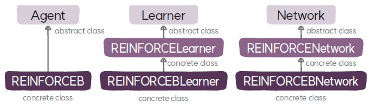

# REINFORCEBLearner 클래스
`REINFORCEBLearner`는 REINFORCE 베이스라인 적용 알고리즘의 학습자 클래스로 `REINFORCELearner`를 상속한다.

## REINFORCEBLearner
### 속성
* **베이스라인 모델(`baseline`)**: 정책의 목적 함수를 계산할 때 분산을 줄이기 위해 사용하는 베이스라인을 출력하는 모델이다.
* **베이스라인 학습률 스케줄러(`baseline_lr_scheduler`)**: 베이스라인 모델을 위한 학습률 스케줄러로 코사인 스케줄러를 사용한다.
* **MSE 손실 함수(`MSELoss`)**: 베이스라인 모델의 손실 함수로 사용할 평균 제곱 오차 손실 함수이다.

### 메서드
* **`__init__`**: `REINFORCELearner` 클래스의 초기화 메서드를 호출해 학습자를 초기화 하고, 베이스라인 모델의 학습을 위한 `Adam` 옵티마이저와 학습률 스케줄러를 생성한다.
* **`make_lr_scheduler`**: 정책과 베이스라인 모델의 학습률 스케줄러를 생성한다.
* **`_calc_returns`**: 몬테카를로 리턴을 계산할 때 베이스라인을 이용해서 리턴에서 베이스라인을 뺀 값을 이득으로 계산한 후 버퍼에 추가 데이터 필드로 저장한다.
* **`update`**: 정책의 손실 함수에 리턴 대신 베이스라인을 적용한 이득을 사용해서 정책과 함께 베이스라인 모델을 학습한다.