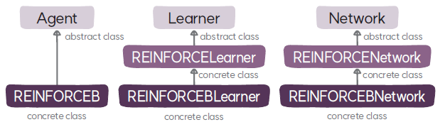

# REINFORCEBNetwork 클래스
`REINFORCEBNetwork`는 REINFORCE 알고리즘의 학습자 클래스로 `REINFORCENetwork`를 상속한다.

## 5. REINFORCEBNetwork 클래스
### 속성
* **베이스라인 모델(`baseline`)**: 정책의 목적 함수를 계산할 때 분산을 줄이기 위해 사용하는 베이스라인을 출력하는 모델로 MLP 클래스를 이용해서 생성한다.

### 메서드
* **`__init__`**: 부모 클래스인 `REINFORCENetwork`의 초기화 함수를 호출해서 네트워크를 초기화 및 정책을 생성하고 추가적으로 베이스라인을 생성한다.
* **`make_baseline`**: 상태를 입력 받고 베이스라인을 출력하는 베이스라인 모델 생성한다.
* **`cuda`**: 정책과 베이스라인 모델의 상태(파라미터와 버퍼)를 GPU로 이동한다.
* **`forward`**: 네트워크를 실행해서 해당 상태에서의 행동의 로그 가능도와 베이스라인을 계산한다.