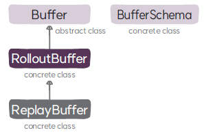

#  ReplayBuffer 클래스
`ReplayBuffer` 클래스는 오프라인 정책을 위한 버퍼로, 새로운 데이터는 계속해서 추가하고 버퍼가 꽉 차면 오래된 데이터부터 지우는 순환 버퍼로 운영한다.

## ReplayBuffer

### 속성
* **버퍼에 저장된 트랜지션 수(`n_transitions`)**: 버퍼에 저장된 데이터의 수를 나타낸다. 버퍼의 현재의 위치(transition_index) 이후 공간이 비어 있는지 데이터로 채워져 있는지를 판단하기 위해 관리한다.

### 메서드
* **`__init__`**: 부모 클래스인 `RolloutBuffer`의 초기화 함수를 호출해 버퍼를 초기화하고 버퍼에 저장된 트랜지션 수를 설정한다.
* **`append_from_other_buffer`**: 다른 버퍼의 내용을 현재 위치부터 이어서 저장한다. 순환 버퍼이기 때문에 버퍼가 꽉 차면 처음으로 연결해서 저장한다.
* **`increment_transition_index`**: 버퍼의 현재 위치를 오프셋만큼 뒤로 이동한다. 단, 순환 버퍼이기 때문에 마지막에서 처음으로 연결해서 이동한다.
* **`clear`**: 버퍼를 초기화 하고 버퍼의 현재 위치와 버퍼에 저장된 트랜지션 수를 0으로 설정한다.
* **`__len__`**: 저장된 데이터의 개수를 반환한다.