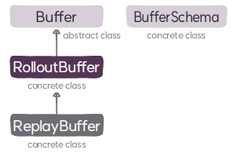

#  RolloutBuffer 클래스
`RolloutBuffer` 클래스는 온라인 정책을 위한 버퍼로, 트랜지션 데이터를 저장할 수 있는 1차원 버퍼로 정의되며 인덱스 기반의 접근과 데이터의 추가, 배치 샘플링 기능을 제공한다.

## RolloutBuffer

### 속성
* **버퍼의 현재의 위치(`transition_index`)**: 버퍼에 데이터가 저장되지 않은 첫 번째 요소의 인덱스로 새로운 데이터를 추가할 수 있는 위치이다.

### 메서드
#### 초기화
* **`__init__`**: 부모 클래스인 `Buffer`의 초기화 함수를 호출해 버퍼를 초기화 하고, 현재 버퍼의 위치를 초기화 한다.
#### 인덱스 기반 접근
* **`__getitem__`**: 버퍼를 ➊ 데이터 필드 이름으로 읽거나 ➋ 인덱스 기반으로 읽는다.
* **`__setitem__`**: 버퍼에 ➊ 데이터 필드 이름으로 쓰거나 ➋ 인덱스 기반으로 쓴다.
#### 배치 샘플링
* **`can_sample`**: 배치 샘플링이 가능한지 여부를 반환한다. 배치 크기보다 버퍼에 저장된 데이터가 많으면 `True`를 그렇지 않으면 `False`를 반환한다.
* **`sample`**: 배치를 랜덤 샘플링 한다.
#### + 연산
* **`__add__`**: + 연산자 구현 메서드로 버퍼에 ➊ 트랜지션 데이터를 추가하거나 ➋ 다른 버퍼 내용을 추가한다.
* **`append_from_other_buffer`**: 다른 버퍼의 내용을 버퍼에 추가한다.
* **`append_one_transition_data`**: 트랜지션 데이터를 버퍼에 추가한다.
* **`increment_transition_index`**: 버퍼의 현재 위치를 오프셋만큼 뒤로 옮긴다.
#### 버퍼 데이터 삭제/길이
* **`clear`**: 버퍼를 초기화 하고 버퍼의 현재 위치를 0으로 설정한다.
* **`__len__`**: 저장된 데이터의 개수를 반환한다.