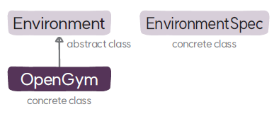

# Environment 클래스
`Environment`는 환경을 정의하는 베이스 클래스이다.

## Environment
### 메서드
* **`render`**: 강화학습 환경을 화면에 렌더링하는 추상 메서드이다.
* **`reset`**: 환경을 리셋하는 추상 메서드이다.
* **`step`**: 환경에 대해 행동을 취하고 결과를 반환하는 추상 메서드이다.
* **`close`**: 환경을 종료하는 추상 메서드이다.
* **`environment_spec`**: 환경의 MDP 정보를 표준화된 형태로 제공하는 추상 메서드이다.
* **`max_episode_limit`**: 환경의 최대 에피소드 길이를 반환하는 추상 메서드이다.
