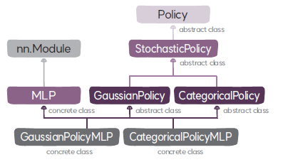

# Policy 클래스
`Policy`는 정책의 베이스 클래스이다.

## Policy 클래스

### 속성
* **상태의 크기(`state_size`)**: 상태 벡터의 크기로 정책 모델의 입력 계층의 뉴런 수를 결정한다.
* **행동의 크기(`action_size`)**: 정책 모델의 출력 계층의 뉴런 수를 결정한다. ➊ 연속 행동인 경우에는 행동의 개수를 의미하고 ➋ 이산 행동인 경우 행동의 종류를 의미한다.