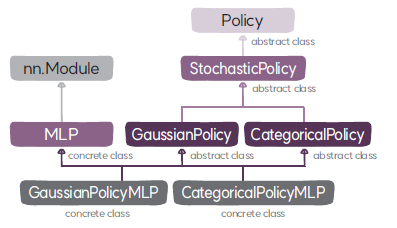

# 정책 | [가치 함수](README_ValueFunction.md)
환경의 상태에 따라 에이전트의 행동을 출력하는 함수이다.

## 1. 디렉토리 구성
| 파일 이름                  | 설명                        |
|:-----------------------|:--------------------------|
| `models.py`	          | 정책 클래스인 `Policy`, `StochasticPolicy`, `GaussianPolicy`, `CategoricalPolicy`, `GaussianPolicyMLP`, `CategoricalPolicyMLP`와 순방향 신경망 클래스인 `MLP`가 정의돼 있다. | 

##  2. 클래스
정책의 클래스는 다음과 같이 구성돼 있다.

정책 클래스는 `Policy`라는 베이스 클래스에서 시작한다.
* [`Policy`](Policy.md): 정책 클래스의 최상위 클래스
정책은 행동의 분포를 출력하는 확률적 정책 `StochasticPolicy`과 결정적인 행동을 출력하는 결정적 정책 `DeterminiticPolicy`로 확장된다. 
단, 현재 강화학습 프레임워크에는 `StochasticPolicy`만 포함돼 있다.
* [`StochasticPolicy`](StochasticPolicy.md): 행동의 확률 분포를 출력하는 정책

확률적 정책은 연속 행동일 경우 가우시안 분포로 출력하는 `GaussianPolicy`로, 이산 행동일 경우 카테고리 분포로 출력하는 `CategoricalPolicy`로 확장된다.
* [`GaussianPolicy`](GaussianPolicy.md): 가우시안 분포를 출력하는 정책
* [`CategoricalPolicy`](CategoricalPolicy.md): 카테고리 분포를 출력하는 정책

상태 데이터가 벡터인 경우 정책을 순방향 신경망 모델로 정의하기 위해 MLP 클래스를 상속한다.
* [`MLP`](MLP.md): 순방향 신경망 클래스

다음 두 클래스는 연속 행동과 및 이산 행동에 대한 확률 분포를 출력하는 순방향 신경망으로 정의된 정책이다.
* [`GaussianPolicyMLP`](GaussianPolicyMLP.md): 가우시안 분포를 출력하는 MLP 정책
* [`CategoricalPolicyMLP`](CategoricalPolicyMLP.md): 카테고리 분포를 출력하는 MLP 정책