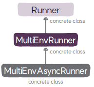

# MultiEnvAsyncRunner 클래스

`MultiEnvAsyncRunner`는 여러 개의 환경을 비동기적으로 분산 처리를 하기 위해 
비동기 방식의 다중 환경 러너로 `MultiEnvRunner`를 상속하고 있다.

## MultiEnvAsyncRunner

### 메서드
* **`__init__`**: 부모 클래스 MultiEnvRunner의 초기화 메서드를 호출해 러너를 초기화한다.
* **`train`**: 최대 환경 실행 스텝만큼 ➊ 환경 루프를 실행해서 데이터를 수집하고 ➋ 정책을 평가하고 개선하는 과정을 반복한다. 단, 데이터 수집을 빠르게 하기 위해 환경 루프를 환경의 개수만큼 병렬 실행하며 실행이 완료된 순서대로 즉시 실행 결과를 반환 받아서 데이터셋을 구성하고 에이전트를 학습한다(비동기적 실행).
* **`run_environment_loop`**: 지정된 환경 루프에 대해 지정된 실행 타입 스텝 수 또는 에피소드 수만큼 에이전트와 환경의 상호작용을 원격 실행한다(비동기적 실행).
* **`update_actor`**: 에이전트의 네트워크 파라미터를 지정된 환경 루프에 있는 액터의 복사본에 동기화한다(동기적 실행).
* **`reset_stats_environment_loops`**: 전체 환경 루프의 통계 정보를 초기화한다. 단, 실행 완료를 기다리지 않고 바로 다음 실행을 진행한다(비동기적 실행).