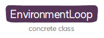

# [러너](README.md) | 환경 루프

에이전트를 대리해서 액터와 환경이 상호작용하는 과정을 환경 루프로 정의하고 있다.

## 1. 디렉토리 구성
| 파일 이름                  | 설명                        |
|:-----------------------|:--------------------------|
| `environment_loop.py`	          | 액터와 환경의 상호작용 루프를 실행하는 `EnvironmentLoop`가 정의돼 있다. |  

##  2. 클래스
환경 루프의 클래스는 다음과 같이 구성돼 있다.

* [**`EnvironmentLoop`**](EnvironmentLoop.md): 액터와 환경의 상호작용 루프를 실행
