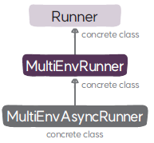

# Runner 클래스
`Runner`는 환경이 한 개일 때 강화학습의 구성 요소를 생성하고 추론과 학습을 위한 전체적인 실행을 관장한다.

## Runner

### 속성
* **로거(`logger`)**: 강화학습 프레임워크 실행 중 발생하는 오류 또는 학습 성능과 관련된 정보를 콘솔 또는 텐서보드에 로깅한다.
* **토큰(`unique_token`)**: 강화학습 프레임워크의 실행을 구분하기 위한 ID이다. 예를 들어 매 실행마다 생성되는 로그나 체크포인트 파일의 저장 경로에 토큰을 넣어서 실행에 대한 산출물을 구분한다.
* **설정(`config`)**: 강화학습 프레임워크의 설정을 관리하는 `SimpleNamespace` 객체이다. 설정을 `SimpleNamespace` 객체로 정의하면 닷 표기법(dot notation)으로 설정 항목을 접근할 수 있다. 예를 들면 학습 에포크epoch를 나타내는 설정 항목은 `config.epoch`와 같이 접근하게 된다.
* **에이전트(`agent`)**: 액터를 통해 환경과 상호작용하며 정책을 평가하고 개선하는 객체이다. 데이터셋, 네트워크, 학습자를 서브 모듈로 두고 있다.
* **환경 루프(`environment_loop`)**: 액터와 환경의 상호작용을 실행하는 객체로 훈련 모드에서는 데이터를 수집하고 추론 모드에서는 강화학습 문제를 해결한다
* **타입 스텝 수(`total_n_timesteps`)**: 에이전트가 환경과 상호작용을 한 누적 타입 스텝 수
* **에피소드 수(`total_n_episodes`)**: 에이전트가 환경에서 실행한 누적 에피소드 수
* **마지막 체크포인트 저장 시점(`last_model_save_timestep`)**: 학습 과정에서 가장 최근에 체크포인트를 저장한 타입 스텝으로 체크포인트 주기를 확인하기 위한 용도로 사용한다.
* **마지막 로깅 시점(`last_logging_step`)**: 학습 과정에서 가장 최근에 화면에 통계 정보를 출력한 타입 스텝으로 통계 정보 콘솔 출력 주기를 확인하기 위한 용도로 사용한다.
* 
###  메서드
#### 초기화
* **`__init__`**: 강화학습 프레임워크 실행에 필요한 유틸리티 객체인 로거, 실행 토큰, 설정을 생성하고 학습에 필요한 카운터 변수를 초기화한다.
* **`sanity_check_config`**: 로컬 실행 환경에 GPU가 있는지 확인해서 설정을 맞게 조정한다. 또한 추론 모드에서 환경이 여러 개이면 한 개로 조정한다.
#### 학습 및 추론
* **`run`**: 환경과 환경 루프를 생성하고 추론 모드이면 `test()` 메서드를 실행하고 훈련 모드이면 `train()` 메서드를 실행한다.
* **`save_checkpoint`**: 학습중인 에이전트의 네트워크와 옵티마이저의 체크포인트를 저장한다.
* **`test`**: 지정된 에피소드 수만큼 환경 루프를 추론 모드로 실행한다.
#### 에이전트
* **`make_agent`**: 설정에 지정된 에이전트 이름으로 에이전트를 생성한다.
* **`update_dataset`**: 환경 루프에서 반환 받은 액터가 수집한 경로 데이터를 에이전트에 전달해서 데이터셋을 구성한다.
* **`update_agent`**: 정책을 평가하고 개선하기 위해 에이전트를 학습한다. 단, 리플레이 버퍼를 워밍업(warming up)하는 단계라면 학습하지 않고 반환한다.
* **`make_environments`**: 에이전트 생성에 필요한 환경 정보를 얻기 위해 임시로 환경을 생성한다.
#### 환경 루프
* **`make_environment_loops`**: 액터를 생성할 때 필요한 정보인 에이전트의 네트워크, 버퍼 스키마, 액터 클래스와 환경 ID를 인자로 전달해 환경 루프를 생성한다.
* **`run_environment_loops`**: 환경 루프를 통해 지정된 실행 타입 스텝 수 또는 에피소드 수만큼 에이전트와 환경의 상호작용을 실행하고 결과를 반환 받는다.
* **`update_actors`**: 에이전트의 네트워크 파라미터를 액터의 복사본에 동기화한다.
* **`reset_stats_environment_loops`**: 환경 루프의 실행 통계 정보를 초기화 한다.
#### 모델 로딩/체크포인트 저장 및 복구
* **`load`**: 지정된 경로에 있는 모델을 에이전트의 네크워크로 로딩한다. 학습이 완료된 추론 모델을 로딩할 때 호출한다.
* **`save`**: 에이전트를 통해 모델과 옵티마이저의 체크포인트를 저장한다.
* **`restore`**: 특정 타임 스텝의 체크포인트를 로딩해서 에이전트의 모델과 옵티마이저를 복구한다.